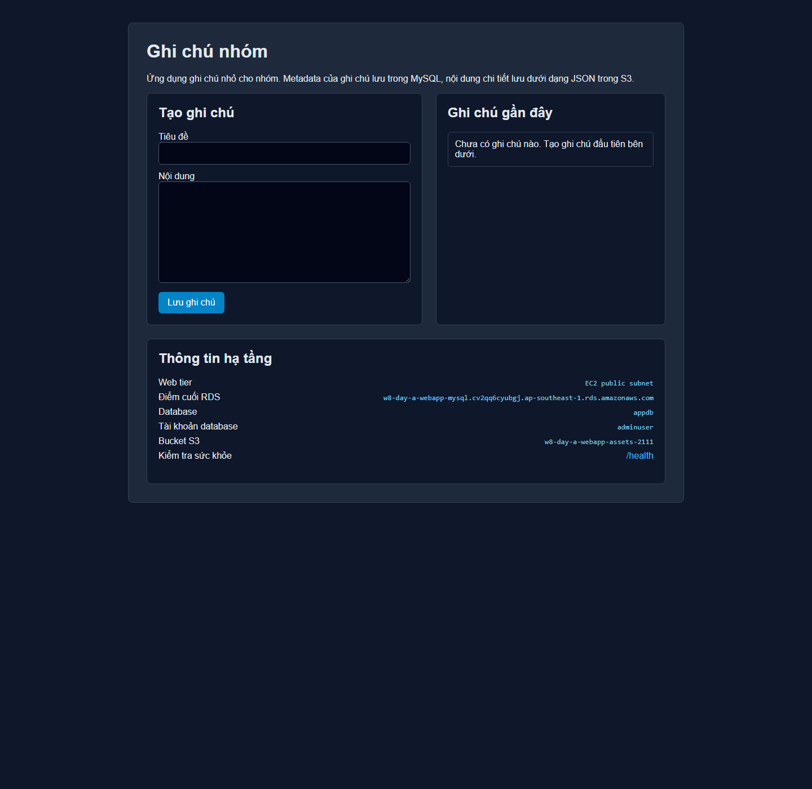
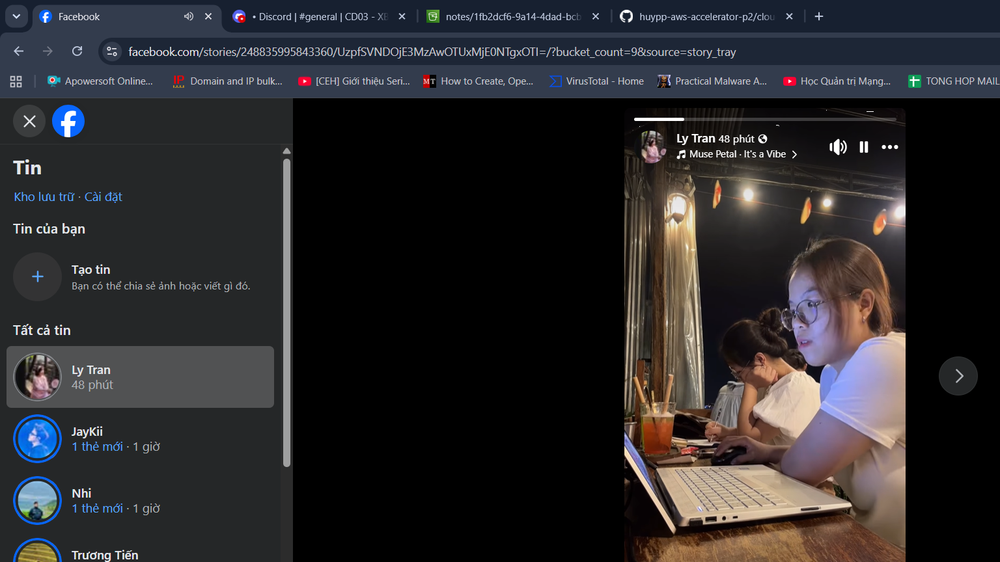

# Day A Lab - Web App AWS bằng Terraform

Lab này triển khai một web app đơn giản nhưng có use case thực tế trên AWS bằng Terraform.

Kiến trúc chính:
- `VPC` dùng module `terraform-aws-modules/vpc/aws`
- `2 public subnet` cho web tier
- `2 private subnet` cho database tier
- `EC2` chạy web app Python phía sau `nginx`
- `RDS MySQL` lưu metadata của ghi chú
- `S3` lưu nội dung ghi chú dạng JSON
- `Terraform remote state` dùng `S3` backend và `DynamoDB` để lock state

## Ảnh giao diện



## Ảnh cấu hình Terraform



## Chức năng ứng dụng

Ứng dụng mẫu là `Ghi chú nhóm`:
- tạo ghi chú mới từ giao diện web
- lưu metadata ghi chú trong bảng `notes` trên `RDS MySQL`
- lưu nội dung chi tiết ghi chú thành file JSON trong `S3`
- liệt kê các ghi chú gần đây ở trang chủ
- có endpoint `GET /health` để kiểm tra `app`, `RDS` và `S3`

## Cấu trúc thư mục

```text
lab/
  .gitignore
  images/
    team-notes-home.png
  main.tf
  outputs.tf
  README.md
  terraform.tfvars.example
  user_data.sh.tftpl
  variables.tf
  versions.tf
  remote-state/
    main.tf
    outputs.tf
    variables.tf
    versions.tf
```

## Tài nguyên được tạo

1. `VPC`, `Internet Gateway`, `NAT Gateway`, route tables và subnet public/private
2. `Security Group` cho EC2:
   - mở `HTTP 80` từ Internet
   - mở `SSH 22` từ `admin_ingress_cidrs`
3. `Security Group` cho RDS:
   - chỉ cho phép `MySQL 3306` từ security group của EC2
4. `EC2` public subnet:
   - chạy `Python Flask`
   - reverse proxy bằng `nginx`
5. `RDS MySQL` private subnet:
   - database name mặc định: `appdb`
   - master password được quản lý bằng `AWS Secrets Manager`
6. `S3 bucket` cho static/assets và note JSON:
   - bật versioning
   - bật server-side encryption AES256
   - block public access
7. `IAM role` cho EC2:
   - đọc secret của RDS
   - đọc/ghi object trong bucket S3 của lab

## Yêu cầu trước khi chạy

- Terraform `>= 1.5`
- AWS CLI đã cấu hình credentials hợp lệ
- quyền tạo các tài nguyên: `VPC`, `EC2`, `IAM`, `RDS`, `S3`, `DynamoDB`, `Secrets Manager`
- môi trường test đang dùng region `ap-southeast-1`

Kiểm tra nhanh credentials:

```powershell
aws sts get-caller-identity
```

## Cấu hình biến đầu vào


```hcl
aws_region          = "ap-southeast-1"
project_name        = "w8-day-a-webapp"
instance_type       = "t3.micro"
db_instance_class   = "db.t3.micro"
db_name             = "appdb"
db_username         = "adminuser"
admin_ingress_cidrs = ["0.0.0.0/0"]

tags = {
  Owner = "huy"
  Env   = "lab"
}
```

## Bước 1: Tạo remote state

Di chuyển vào thư mục [remote-state](./remote-state):

```powershell
cd remote-state
terraform init
terraform apply -auto-approve
```

Lấy hai output sau:
- `state_bucket_name`
- `lock_table_name`

## Bước 2: Khởi tạo backend cho lab chính

Quay lại thư mục `lab` và init backend:

```powershell
terraform init `
  -backend-config="bucket=<state_bucket_name>" `
  -backend-config="key=day-a/lab/terraform.tfstate" `
  -backend-config="region=<aws_region>" `
  -backend-config="dynamodb_table=<lock_table_name>" `
  -backend-config="encrypt=true"
```

Ghi chú:
- Terraform hiện vẫn chấp nhận `dynamodb_table`, nhưng tham số này đã có cảnh báo deprecate
- với cấu hình hiện tại project vẫn chạy bình thường

## Bước 3: Plan và Apply

```powershell
terraform plan
terraform apply -auto-approve
```

Sau khi apply thành công, lấy output:

```powershell
terraform output web_url
terraform output healthcheck_url
terraform output web_public_ip
```

## Trạng thái kiểm tra thực tế

Đã kiểm tra trong môi trường hiện tại:
- `terraform validate` thành công
- `terraform plan` thành công
- endpoint `GET /health` trả về trạng thái `ok` cho cả `app`, `RDS`, `S3`

Ví dụ health response:

```json
{
  "app": {
    "message": "Ứng dụng hoạt động bình thường",
    "status": "ok"
  },
  "rds": {
    "query_result": 1,
    "status": "ok"
  },
  "s3": {
    "bucket": "w8-day-a-webapp-assets-2111",
    "sample_keys": [],
    "status": "ok"
  }
}
```

## Output chính

- `web_url`: URL giao diện web app
- `healthcheck_url`: URL kiểm tra sức khỏe hệ thống
- `web_public_ip`: public IP của EC2
- `rds_endpoint`: endpoint của MySQL trong private subnet
- `static_assets_bucket_name`: tên bucket S3 dùng cho app
- `db_master_secret_arn`: ARN của secret chứa mật khẩu master DB
- `vpc_id`, `public_subnet_ids`, `private_subnet_ids`: thông tin mạng phục vụ kiểm tra

## Ghi chú triển khai

- file [user_data.sh.tftpl](./user_data.sh.tftpl) bootstrap trực tiếp app trên EC2
- thay đổi `user_data` sẽ làm thay EC2 vì `user_data_replace_on_change = true`
- `RDS` ở private subnet nên không truy cập trực tiếp từ Internet
- `EC2` có public IP nên có thể truy cập web app trực tiếp từ bên ngoài
- app chỉ dùng `RDS` cho metadata và dùng `S3` cho nội dung note để bám đúng yêu cầu bài

## Dọn tài nguyên sau khi test

Lab này có `NAT Gateway`, `RDS`, `EC2`, `S3`, nên sẽ phát sinh chi phí nếu để chạy lâu.

Khi không dùng nữa:

```powershell
terraform destroy -auto-approve
cd remote-state
terraform destroy -auto-approve
```
