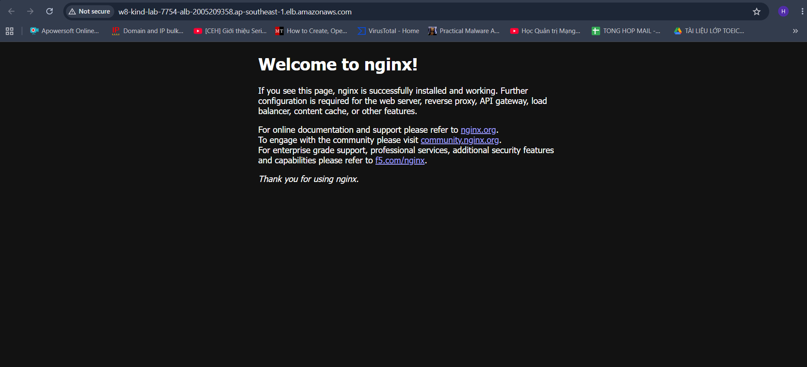

# Evidence Pack - K8s on AWS Terraform 1-Click

## 1. Mục tiêu bài lab

Mục tiêu của bài là dựng một môi trường Kubernetes chạy trên EC2 bằng Terraform, deploy một ứng dụng nhỏ trong cluster, và public ứng dụng đó ra Internet qua AWS ALB, tất cả bằng một lần `terraform apply`.

## 2. Kiến trúc triển khai

```text
Internet
   |
   v
AWS ALB :80
   |
   v
EC2 :8080
   |
   v
kind extraPortMappings
hostPort 8080 -> containerPort 30080
   |
   v
Kubernetes Service type NodePort :30080
   |
   v
Pod nginx:alpine :80
```

## 3. Cách giải quyết đề bài

Giải pháp chọn `kind` thay vì `minikube`, chạy trên một EC2 duy nhất.

Luồng thực hiện:

1. Terraform dùng provider `aws` để dựng `VPC`, `subnet`, `route`, `Internet Gateway`, `security group`, `EC2`, `ALB`, `target group`, `listener`.
2. EC2 chạy script `user_data` để cài Docker, `kubectl`, `kind`, rồi tạo cluster Kubernetes 1 node.
3. Terraform dùng `null_resource` + `remote-exec` để SSH vào EC2, đợi cluster sẵn sàng và deploy app `nginx:alpine` bằng manifest Kubernetes.
4. App được expose bằng `Service` kiểu `NodePort 30080`.
5. `kind` map `hostPort 8080` của EC2 vào `NodePort 30080` trong cluster.
6. AWS ALB forward traffic HTTP từ Internet vào EC2 port `8080`.
7. Terraform dùng `scp` để kéo kubeconfig từ EC2 về local sau khi deploy xong.

## 4. Mapping với yêu cầu đề bài

| Yêu cầu | Cách đáp ứng |
|---|---|
| Hạ tầng dựng bằng Terraform | Dùng provider `aws` trong [main.tf](./main.tf) |
| Cụm K8s chạy bằng minikube hoặc kind trên EC2 | Dùng `kind` trong [user_data.sh.tftpl](./user_data.sh.tftpl) |
| App chạy trong K8s | Deploy `nginx:alpine` bằng manifest trong `null_resource.deploy_k8s_manifests` |
| App truy cập từ Internet qua ALB | Dùng `aws_lb`, `aws_lb_target_group`, `aws_lb_listener` trong [main.tf](./main.tf) |
| Một lệnh dựng tất cả | `terraform apply -auto-approve` |
| Dùng >= 2 provider Terraform | Dùng `aws`, `tls`, `local`, `null`, `random` |

## 5. Provider được wire như thế nào

Lab này không chỉ dùng `aws` để tạo hạ tầng, mà còn phối hợp nhiều provider trong cùng một `apply`.

- `aws`
  Tạo toàn bộ hạ tầng AWS: mạng, EC2, ALB, target group, listener.
- `tls`
  Sinh SSH key pair ngay trong Terraform.
- `local`
  Ghi private key ra file local `lab-key.pem`.
- `null`
  Dùng `remote-exec` để SSH vào EC2 bootstrap/deploy app, và `local-exec` để `scp` kubeconfig về local.
- `random`
  Sinh suffix cho tên ALB và target group để tránh lỗi trùng tên khi apply nhiều lần.

Luồng wire provider:

1. `tls_private_key.ssh` sinh key.
2. `local_sensitive_file.ssh_private_key` ghi key ra local.
3. `aws_key_pair.lab` đưa public key lên AWS.
4. `aws_instance.kind_host` tạo EC2.
5. `null_resource.wait_for_bootstrap` SSH vào EC2 để chờ cluster lên.
6. `aws_lb_target_group_attachment.instance` gắn EC2 vào target group.
7. `null_resource.deploy_k8s_manifests` SSH vào EC2 để `kubectl apply`.
8. `null_resource.fetch_kubeconfig` dùng `scp` lấy kubeconfig về máy local.

## 6. File nào làm gì

- [versions.tf](./versions.tf)
  Khai báo version Terraform và các provider.
- [variables.tf](./variables.tf)
  Khai báo biến cấu hình như region, port, CIDR, instance type.
- [main.tf](./main.tf)
  Chứa toàn bộ resource AWS và các `null_resource` để bootstrap/deploy/fetch kubeconfig.
- [user_data.sh.tftpl](./user_data.sh.tftpl)
  Script bootstrap chạy khi EC2 khởi tạo.
- [outputs.tf](./outputs.tf)
  In ra URL ALB, IP EC2, đường dẫn kubeconfig.
- [README.md](./README.md)
  Hướng dẫn chạy, sơ đồ kiến trúc, giải thích wire provider.

## 7. Bằng chứng triển khai thành công

### 7.1. Terraform output

Output thực tế từ `terraform output -json`:

```json
{
  "alb_url": "http://w8-kind-lab-7754-alb-2005209358.ap-southeast-1.elb.amazonaws.com",
  "ec2_public_ip": "54.179.23.138",
  "kubeconfig_path": "./.generated/kubeconfig.yaml"
}
```

### 7.2. Bằng chứng app public qua ALB

- URL public:
  `http://w8-kind-lab-7754-alb-2005209358.ap-southeast-1.elb.amazonaws.com`
- Đây là output từ Terraform sau khi `aws_lb` và `aws_lb_listener` tạo xong.

### 7.3. Bằng chứng kubeconfig được kéo về local

- File local:
  `./.generated/kubeconfig.yaml`
- Resource thực hiện:
  `null_resource.fetch_kubeconfig` trong [main.tf](./main.tf)

### 7.4. Bằng chứng cluster được bootstrap xong

Resource xác nhận cluster sẵn sàng:

- `null_resource.wait_for_bootstrap`
- Lệnh kiểm tra:
  `kubectl --kubeconfig=/home/ec2-user/.kube/config wait --for=condition=Ready nodes --all --timeout=180s`

### 7.5. Bằng chứng app được deploy vào Kubernetes

Resource deploy app:

- `null_resource.deploy_k8s_manifests`

Manifest được tạo và apply gồm:

- `Deployment` tên `web-app`
- `Service` tên `web-service`
- `Service` kiểu `NodePort`

## 8. Lệnh chạy

```bash
terraform init
terraform apply -auto-approve
```

Kiểm tra sau khi apply:

```bash
kubectl --kubeconfig ./.generated/kubeconfig.yaml get nodes
kubectl --kubeconfig ./.generated/kubeconfig.yaml get pods,svc
```

Xóa tài nguyên:

```bash
terraform destroy -auto-approve
```

## 9. Điểm thiết kế đáng chú ý

- Không dùng EKS, vì bài yêu cầu Kubernetes chạy trên EC2 và `kind` đáp ứng tốt cho lab.
- Không cài AWS Load Balancer Controller trong cluster để tránh tăng độ phức tạp.
- Dùng ALB target trực tiếp vào EC2, còn `kind` đảm nhiệm map `hostPort 8080` vào `NodePort 30080`.
- Cách này giữ được tính đơn giản, đúng yêu cầu, và dễ giải thích trong buổi demo.
