# W9 Challenge - Ship Smartly

Thư mục này dùng riêng cho challenge `Ship Smartly` của W9.

Mục tiêu của challenge:

1. Mọi thay đổi đi qua Git, ArgoCD tự sync.
2. Có 1 SLO và 1 alert khi chất lượng tụt.
3. Canary bản tốt lên 100%, bản lỗi tự abort.
4. Có thể rollback lâu dài bằng `git revert`.

## 1. Cấu trúc challenge

```text
challenge/
  app/
    app.py
    Dockerfile
  argocd/
    apps/
      api-challenge.yaml
  k8s-api/
    namespace.yaml
    api.yaml
    servicemonitor.yaml
    analysis-template.yaml
    prometheusrule.yaml
    alertmanagerconfig.yaml
    alert-email-secret.example.yaml
    .gitignore
  evidence/
    01-structure.png
    02-argocd-app.png
    03-analysisrun-success.png
    04-prometheus-good.png
    05-bad-version.png
    06-analysisrun-failed.png
    07-rollout-aborted.png
    08-prometheus-bad.png
    09-prometheus-alert-firing.png
    10-alertmanager-alert.png
    12-email-success.png
    13-rollout-events-recovery.png
    14-rollout-healthy.png
    15-argocd-synced-healthy.png
    16-analysisrun-summary.png
    17-git-revert-and-push.png
```

Ảnh cấu trúc challenge:

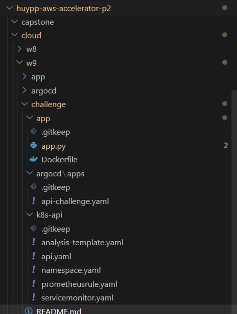

## 2. Vai trò từng file

- `app/app.py`: app Flask nhỏ có `/`, `/healthz` và `/metrics`.
- `app/Dockerfile`: build image API dùng cho challenge.
- `argocd/apps/api-challenge.yaml`: `Application` của ArgoCD cho challenge.
- `k8s-api/namespace.yaml`: tạo namespace `demo-challenge`.
- `k8s-api/api.yaml`: định nghĩa `Rollout`, service stable `api` và service canary `api-canary`.
- `k8s-api/servicemonitor.yaml`: để Prometheus scrape metric từ app.
- `k8s-api/analysis-template.yaml`: rule phân tích metric cho canary.
- `k8s-api/prometheusrule.yaml`: alert rule cho SLO error rate.
- `k8s-api/alertmanagerconfig.yaml`: route alert của challenge sang receiver email.
- `k8s-api/alert-email-secret.example.yaml`: file mẫu để tạo secret chứa Gmail App Password.

## 3. GitOps

Challenge này chạy theo GitOps:

- Manifest nằm trong Git.
- ArgoCD đọc manifest từ GitHub.
- Cluster tự đồng bộ theo Git.
- Khi cần rollback lâu dài thì dùng `git revert`, không sửa tay trong cluster.

Ảnh ArgoCD app của challenge:

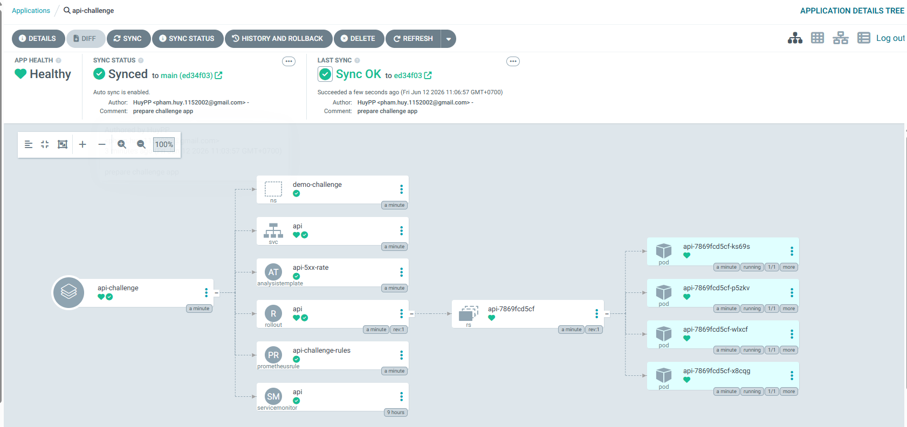

## 4. SLI, SLO và Alert

### SLI

SLI được chọn là tỷ lệ lỗi `5xx` của API trong namespace `demo-challenge`.

Query:

```promql
sum(rate(flask_http_request_total{service="api",namespace="demo-challenge",status=~"5.."}[5m]))
/
sum(rate(flask_http_request_total{service="api",namespace="demo-challenge"}[5m]))
```

### SLO

SLO được chọn là:

- Error rate < 5%

### Alert

Alert được định nghĩa trong `prometheusrule.yaml`.

Điều kiện:

```promql
(
  sum(rate(flask_http_request_total{service="api",namespace="demo-challenge",status=~"5.."}[5m]))
  /
  sum(rate(flask_http_request_total{service="api",namespace="demo-challenge"}[5m]))
) > 0.05
```

Thời gian giữ ngưỡng:

- `for: 2m`

### Gửi email qua Alertmanager

Cấu hình receiver email của challenge nằm trong `alertmanagerconfig.yaml`.

Với dữ liệu nhạy cảm:

- Không push `alert-email-secret.yaml` thật lên Git.
- Chỉ giữ `alert-email-secret.example.yaml` làm file mẫu.
- Tạo secret thật trực tiếp trong cluster bằng `kubectl`.

Ví dụ:

```powershell
kubectl -n demo-challenge create secret generic alert-email-secret --from-literal=password="APP_PASSWORD_CUA_BAN"
```

Nếu dùng Gmail:

- `from` và `authUsername` phải là Gmail đã tạo `App Password`.
- Không dùng mật khẩu đăng nhập Gmail thường.
- Phải bật `2-Step Verification` trước khi tạo `App Password`.

## 5. Canary tự động

`Rollout` trong `api.yaml` dùng chiến lược canary.

Luồng chạy:

1. Thả 25% bản mới qua `api-canary`.
2. Chạy `AnalysisTemplate`.
3. Nếu metric tốt thì tăng tiếp.
4. Nếu metric xấu thì abort.

Điểm quan trọng của manifest hiện tại:

- `api` là stable service cho traffic chính.
- `api-canary` là canary service chỉ dùng để đo bản mới.
- `AnalysisTemplate` chỉ đo metric của `service="api-canary"`.

Query hiện tại trong `analysis-template.yaml`:

```promql
sum(rate(flask_http_request_total{service="api-canary",namespace="demo-challenge",status=~"5.."}[2m])) or on() vector(0)
```

Ngưỡng pass/fail:

- Pass: `result[0] < 0.1`
- Fail: `failureLimit: 1`, `count: 3`

## 6. Kịch bản tốt

Trong `api.yaml`:

```yaml
- name: ERROR_RATE
  value: "0"
- name: VERSION
  value: "v-good-2"
```

Kỳ vọng:

- App có traffic.
- Không có lỗi `5xx` đáng kể.
- `AnalysisRun` thành công.
- Rollout đi tiếp đến bản mới.

Ảnh `AnalysisRun` thành công:

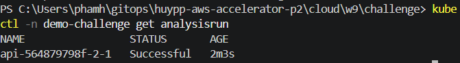

Ảnh Prometheus cho bản tốt:

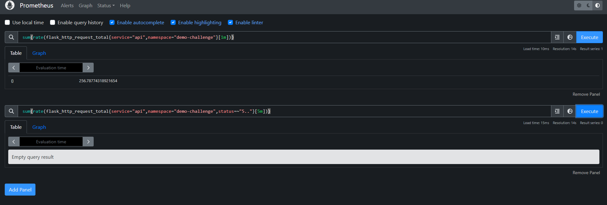

## 7. Kịch bản xấu

Khi muốn tạo bản lỗi để kiểm tra challenge:

```yaml
- name: ERROR_RATE
  value: "1"
- name: VERSION
  value: "v-bad-2"
```

Ảnh cấu hình bad version:

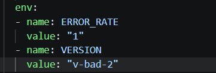

Ý nghĩa:

- Đây là thay đổi thật trong manifest, đi qua Git như yêu cầu challenge.
- Bản mới được cố tình inject lỗi bằng `ERROR_RATE=1`.

Kỳ vọng:

- Metric `5xx` tăng.
- Alert fire.
- `AnalysisRun` fail.
- Rollout abort.
- Stable version cũ vẫn phục vụ traffic.

Ảnh `AnalysisRun` fail:

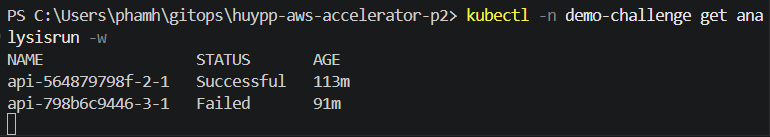

Ý nghĩa:

- Có thể thấy lần trước `Successful`, lần rollout bản lỗi chuyển sang `Failed`.
- Đây là bằng chứng `AnalysisTemplate` đã chặn bản canary xấu.

Ảnh tổng hợp `AnalysisRun`:

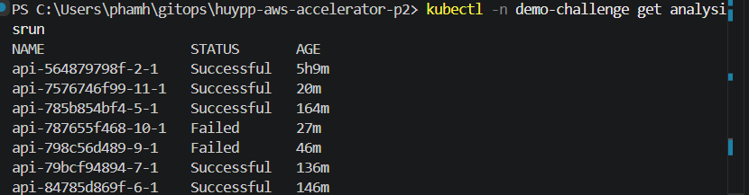

Ý nghĩa:

- Ảnh này là output ngắn, dễ chấm nhất cho phần canary.
- Trong cùng một màn hình có thể thấy nhiều revision `Successful`, đồng thời có các revision `Failed`.
- Nó chứng minh hệ thống đã trải qua cả hai trạng thái: bản xấu bị chặn, bản tốt có thể đi tiếp.

Ảnh `RolloutAborted`:

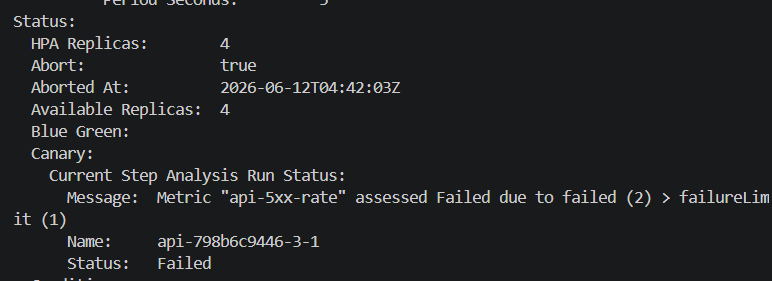

Ý nghĩa:

- Dòng `Abort: true` chứng minh rollout đã tự hủy.
- Message `Metric "api-5xx-rate" assessed Failed` cho thấy abort đến từ metric quan sát được.

Ảnh Prometheus cho bản xấu:

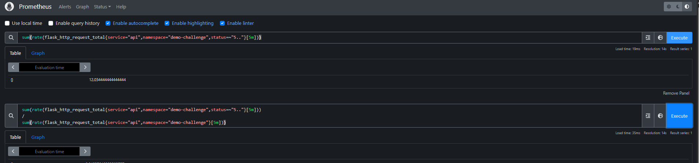

Ý nghĩa:

- Panel trên chứng minh request `5xx` phát sinh thật.
- Panel dưới chứng minh tỷ lệ lỗi vượt ngưỡng SLO.

Ảnh Prometheus alert `FIRING`:

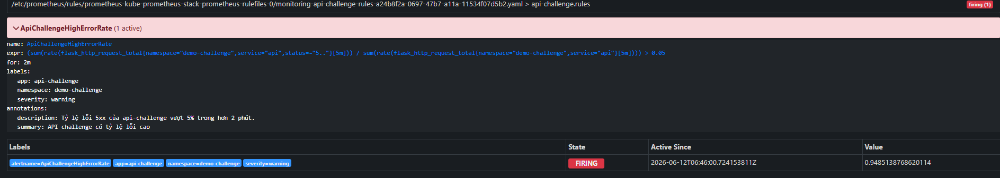

Ý nghĩa:

- Rule `ApiChallengeHighErrorRate` đã thật sự chuyển sang trạng thái `FIRING`.
- Đây là bằng chứng ở lớp Prometheus: SLO bị vi phạm và hệ thống quan sát đã phát hiện sự cố.

Ảnh Alertmanager nhận đúng alert:

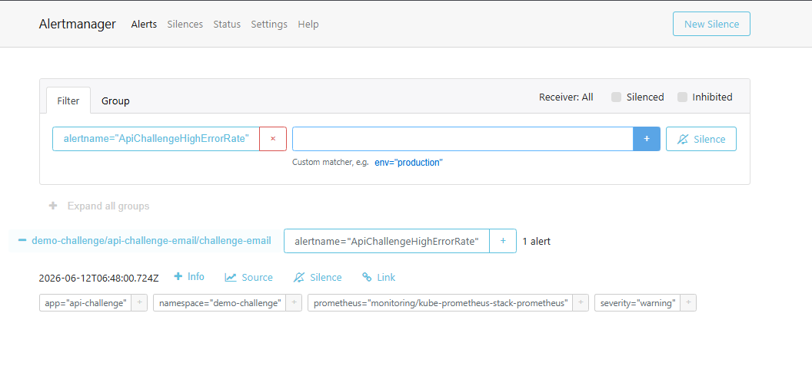

Ý nghĩa:

- Alert từ Prometheus đã được route đúng sang receiver của challenge.
- Có thể đối chiếu trực tiếp `alertname="ApiChallengeHighErrorRate"` với `alertmanagerconfig.yaml`.

## 8. Email cảnh báo

Kết quả cuối cùng:

- Prometheus đã `FIRING`.
- Alertmanager đã nhận đúng alert `ApiChallengeHighErrorRate`.
- Email cảnh báo đã được gửi thành công vào Gmail cá nhân.

Ảnh email nhận được:

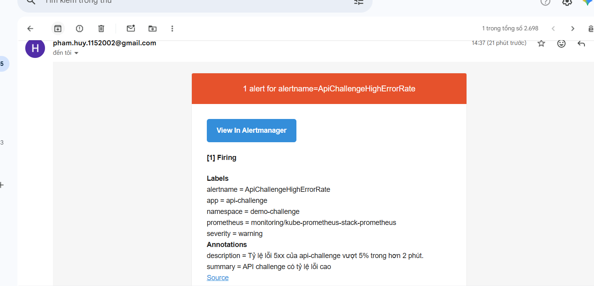

Ý nghĩa:

- Đây là bằng chứng cuối cùng cho yêu cầu alert gửi về email cá nhân.
- Nội dung email có đủ `alertname`, `namespace`, `severity` và `annotations`.

## 9. Trạng thái cuối sau khi sửa bản tốt

Sau khi đưa bản tốt mới lên và để ArgoCD đồng bộ lại, rollout đã quay về trạng thái khỏe.

Ảnh rollout healthy/completed:

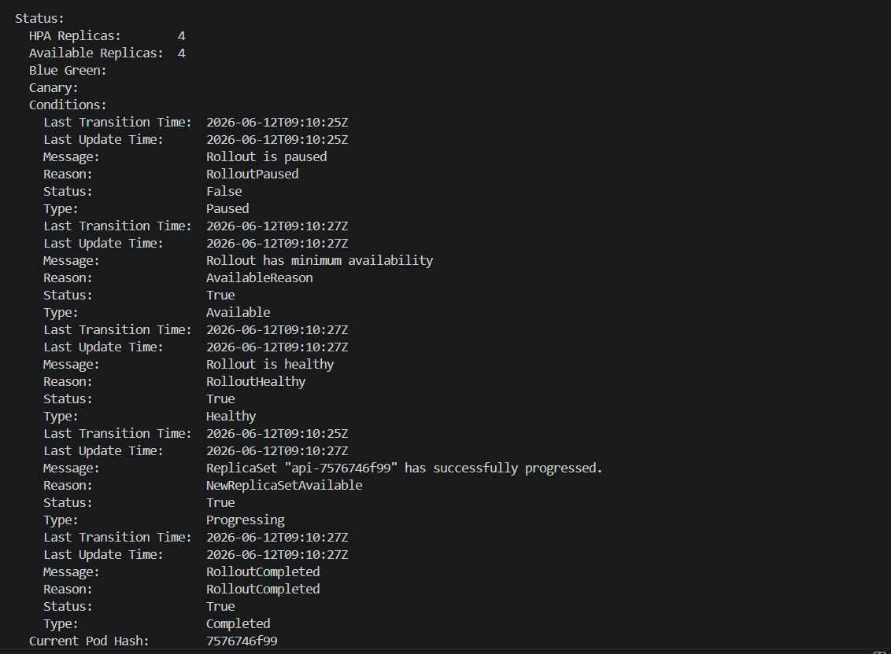

Ý nghĩa:

- `Rollout is healthy`
- `RolloutCompleted`
- `ReplicaSet ... has successfully progressed`

Ảnh event recovery của rollout:

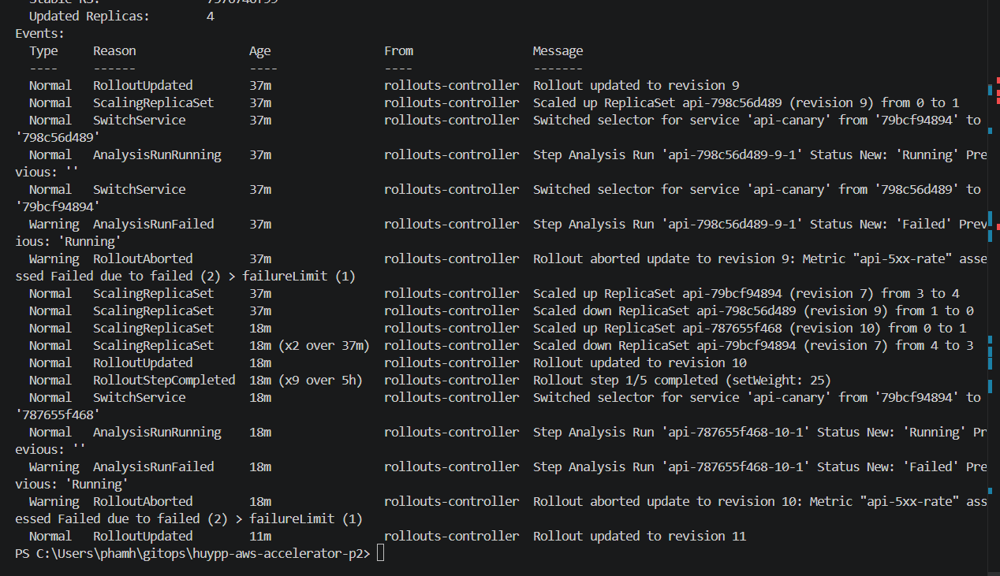

Ý nghĩa:

- Có thể nhìn thấy lịch sử revision lỗi bị abort trước đó.
- Sau đó rollout tiếp tục cập nhật sang revision `11`, chứng minh hệ thống đã recover về bản tốt.

Ảnh ArgoCD trạng thái cuối:

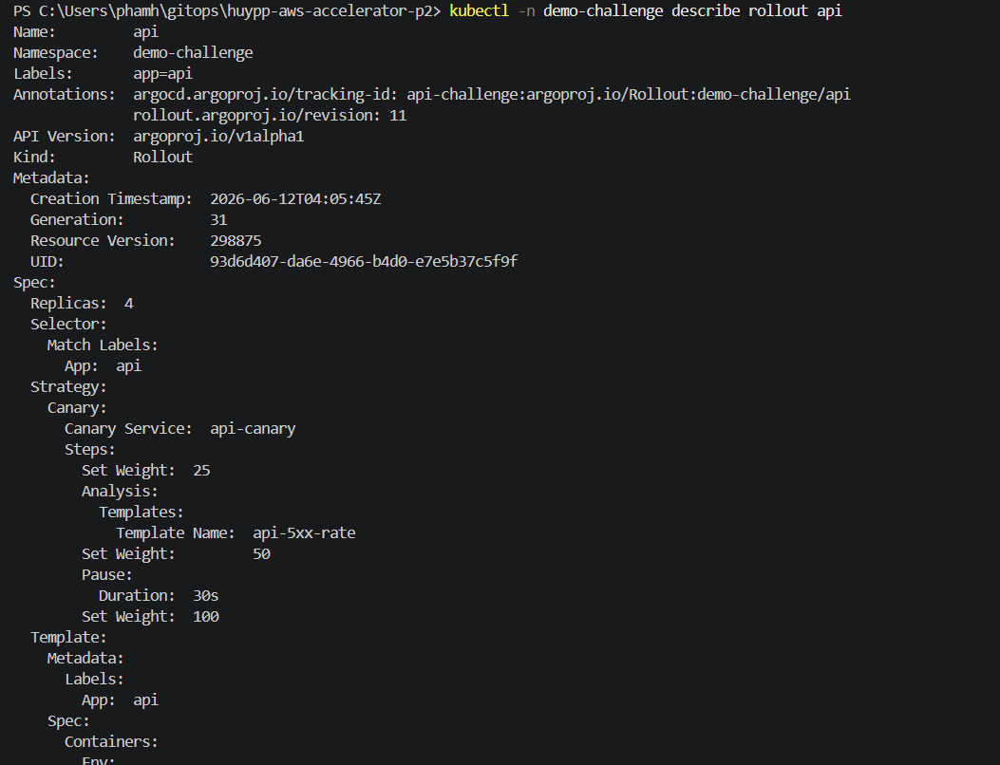

Ý nghĩa:

- Đây là bằng chứng chốt cho yêu cầu `ArgoCD Synced (no drift)`.
- Trạng thái cuối cùng của app là `Synced` và `Healthy`.

## 10. Rollback bằng git revert

Challenge này có 2 lớp rollback:

- `auto-abort`: rollback runtime trong cluster khi rollout bản lỗi
- `git revert`: rollback lâu dài ở mức nguồn sự thật trong Git

Lệnh:

```powershell
git revert HEAD --no-edit
git push
```

Ý nghĩa:

- ArgoCD sync lại desired state tốt.
- Cluster quay về bản ổn định theo Git.

Ảnh rollback bằng `git revert`:

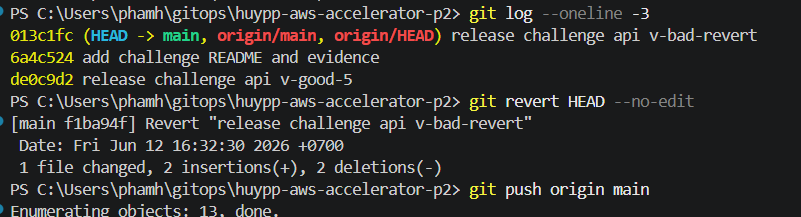

Ý nghĩa:

- Ảnh này chứng minh rollback được thực hiện đúng qua Git, không sửa tay trong cluster.
- Terminal thể hiện rõ thứ tự: xem commit xấu gần nhất, chạy `git revert HEAD --no-edit`, rồi `git push origin main`.
- Đây là bằng chứng trực tiếp cho yêu cầu `rollback bằng git revert`.

## 11. Bằng chứng đã có

Các ảnh hiện đang có trong `challenge/evidence/`:

- `01-structure.png`: cấu trúc thư mục challenge
- `02-argocd-app.png`: ArgoCD app `api-challenge`
- `03-analysisrun-success.png`: `AnalysisRun` thành công ở bản tốt
- `04-prometheus-good.png`: Prometheus ở bản tốt
- `05-bad-version.png`: chỉnh `ERROR_RATE=1`, `VERSION=v-bad-2`
- `06-analysisrun-failed.png`: `AnalysisRun` fail ở bản xấu
- `07-rollout-aborted.png`: rollout auto-abort
- `08-prometheus-bad.png`: Prometheus thấy `5xx` và error rate tăng
- `09-prometheus-alert-firing.png`: `ApiChallengeHighErrorRate` ở trạng thái `FIRING`
- `10-alertmanager-alert.png`: Alertmanager nhận đúng alert challenge
- `12-email-success.png`: email thật nhận được trong inbox
- `13-rollout-events-recovery.png`: event cho thấy rollout lỗi trước đó và revision tốt mới đã được cập nhật
- `14-rollout-healthy.png`: rollout ở trạng thái healthy/completed
- `15-argocd-synced-healthy.png`: ArgoCD ở trạng thái `Synced Healthy`
- `16-analysisrun-summary.png`: output ngắn cho thấy rõ revision nào `Failed`, revision nào `Successful`
- `17-git-revert-and-push.png`: terminal chứng minh rollback được thực hiện bằng `git revert` rồi push lên GitHub

## 12. Kết luận

Challenge này đã ghép đủ 3 mảng:

- GitOps
- Observability
- Canary

Flow cuối cùng:

- Đổi version qua Git
- ArgoCD tự sync
- Canary thả dần
- Prometheus đo metric
- Analysis tự chấm bản canary
- Bản lỗi bị auto-abort
- Alert được gửi qua Alertmanager
- Rollback lâu dài bằng `git revert`
